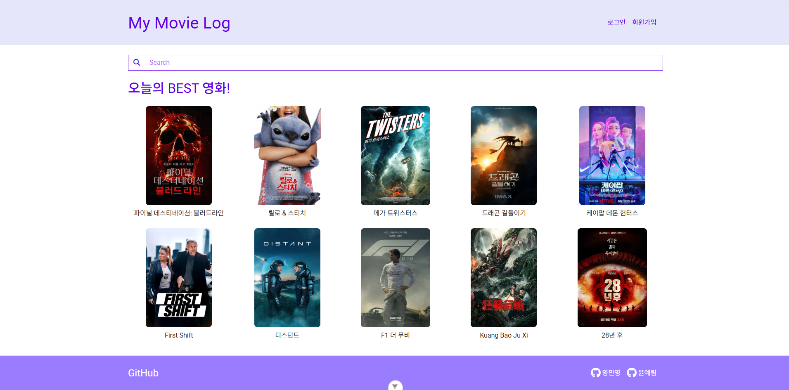
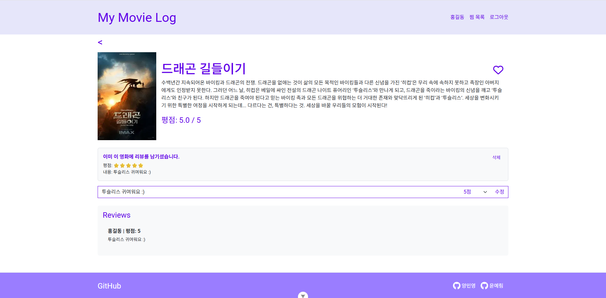
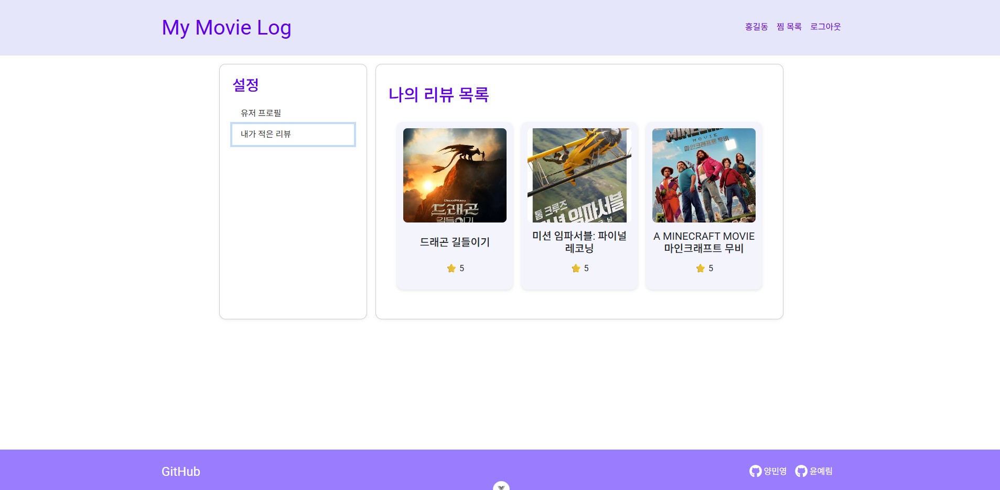
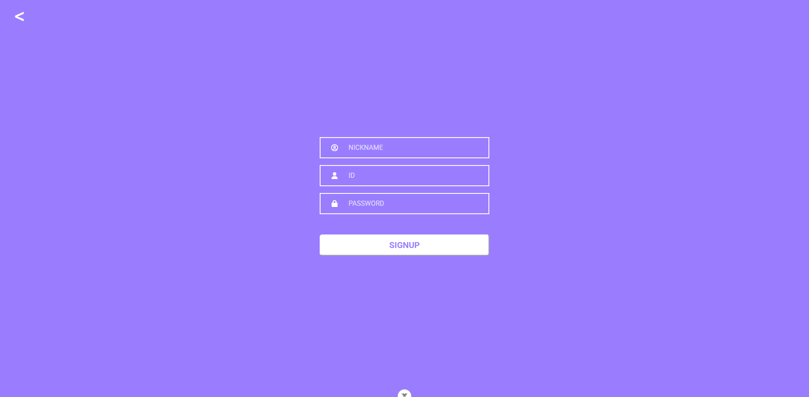

# 🎬 My Movie Log

**TMDB API**를 활용한 영화 추천 및 리뷰 기능이 포함된 **프론트엔드** 연습 프로젝트

## 📌 프로젝트 개요

- **주제**: TMDB API 기반 영화 추천 & 리뷰 웹 앱
- **기간**: 2025.05.02 ~ 2025.06.22
- **인원**: 2명 (양민영, 윤예림)
- **목표**: 로그인, 영화 검색, 찜, 평점, 리뷰 가능한 SPA 개발

## 🚀 배포 주소

👉 [My Movie Log 바로가기](https://minyoung06.github.io/My-Movie-Log/)

> ⚠️ **주의사항**
>
> - 본 프로젝트는 GitHub Pages에서 정적으로 배포되어 있어 로그인 외의 기능은 **읽기 전용(READ-ONLY)** 으로 제한됩니다.
> - 따라서 배포 환경에서는 **회원가입, 리뷰 등록/삭제 및 찜 기능이 제한**됩니다.
> - 전체 기능을 테스트하려면 **로컬 환경**에서 `json-server`를 함께 실행해주세요.

## ▶️ 실행 방법 (로컬)

### 1. 프로젝트 클론

```bash
git clone https://github.com/Minyoung06/My-Movie-Log.git
cd My-Movie-Log
```

### 2. 의존성 설치

```bash
npm install
```

> ⚠️ 다음 3~4번 명령어는 터미널 2개를 열어 각각 따로 실행해야 합니다.

### 3. json-server 실행 (포트 3000번 사용)

```bash
npx json-server --watch db.json --port 3000
```

### 4. Vite 개발 서버 실행 (포트 5173 등)

```bash
npm run dev
```

### ✅ 개발 서버 주소

- Vite: `http://localhost:5173`
- json-server(API): `http://localhost:3000`

> `vite.config.js`에 다음과 같은 프록시 설정이 필요합니다:

```js
server: {
  proxy: {
    '/api': {
        target: 'http://localhost:3000',
        changeOrigin: true,
        rewrite: (path) => path.replace(/^\/api/, ''),
      },
  },
},
```

## 🔗 주요 링크

- [🌐 Notion 전체 문서 바로가기](https://shimmering-hope-b8f.notion.site/MyMovieLog-Vue-1dedb7a9621880279b09eacd60532605)

### 🎨 디자인 시안

- [🖌️ Figma 프로토타입 바로가기](https://www.figma.com/proto/주소)

#### 현재 구현 범위

- 화면 간 이동 흐름 (NavBar, 로그인/회원가입, 상세 페이지 등)
- 전체 페이지 구조 확인 가능
- 실제 입력, 검색 기능은 추후 추가 예정

### 🐞 트러블슈팅 기록

- [🔧 트러블슈팅 페이지 바로가기](https://www.notion.so/your-troubleshooting-page)

## 기술 스택

### Frontend


### Backend (Local Dev)


### API & 통신


### 빌드 & 배포


### 개발 도구


### 디자인 도구


### 문서화 & 트러블 슈팅 & 버전 관리


## 👥 역할 분담

| 이름                                               | 담당                                                                            | 역할                                                                                                                                                                                                                                                                                                                                                                                                       |
| -------------------------------------------------- | ------------------------------------------------------------------------------- | ---------------------------------------------------------------------------------------------------------------------------------------------------------------------------------------------------------------------------------------------------------------------------------------------------------------------------------------------------------------------------------------------------------- |
| 양민영 [🔗GitHub](https://github.com/Minyoung06)   | 전체 구조 & 스타일 설계 /<br>라우팅 / TMDB API / 홈 / 서치 / 영화 디테일 / 배포 | - 라우터 설계 및 페이지 연결<br>- TMDB API 연동 (검색, 상세 정보, 인기 영화 추천, 유사한 영화 추천)<br>- `users.json` 생성 및 `github pages` 배포<br>- `favoritesStore`, `ratingStore`, `userStore.js` 수정<br>- `HomePage`, `SearchPage`, `DetailPage`, `404NotFoundPage` 개발<br>- 레이아웃 (`DefaultLayout`, `Navbar`, `Footer`) & UI (`MovieCard`, `Pagination`, `ConfirmModal`) 컴포넌트 수정 및 개발 |
| 윤예림 [🔗GitHub](https://github.com/StarWhale0w0) | 인증 / 찜 / 평점 / 리뷰 / 유저 데이터 관리                                      | - 로그인 / 회원 가입 / 로그인 상태 유지 (`userStore`)<br>- 찜 CRUD 기능 (`favoritesStore`), 평점 기능 / 리뷰 CRUD 기능 (`ratingStore`)<br>- `FavoritesPage`, `ProfilePage`, `LoginPage`, `SignupPage` 개발<br>- `json-server` 구축 및 연동, 테스트 데이터 관리<br>- `vite.config.js` 수정<br>- `ProfilePage` 연관 components (`UserInfo`, `MyWishList`, `MyReview`) 작성                                   |

---

## 🖼️ 실행 화면

### 메인 화면



### 영화 상세 페이지



### 유저 리뷰 화면



### 회원 가입 화면



## 항후 개선 방향

- [ ] TMDB 외 다른 영화 API 추가 (예: 네이버 영화)
- [ ] 로그인 기능 개선
- [ ] 유저 선호 장르 체크 및 추천 기능
